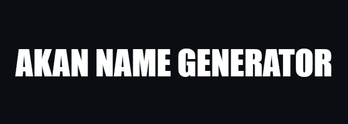

<div align="center">
    
</div>

<div align="center">
    <h2>Author</h2>
</div>
<div align="center">
  Eugene Campbell Gaitano - Fullstack Developer
</div>
<div align="center">
    
</div>
<div align="center">
    
</div>
<div align="center">
    
</div>

## Description

A web application that generates Akan names based on the user's date of birth and gender. Akan names are derived from Ghanian culture. Frequently in
Ghana, children are given their first name as a 'day name' which
corresponds to the day in the week they were born.

## Links

GitHub Pages URL for the site: [Akan Name Generator](https://www.example.com)

Figma Design File: [Figma Akan Name Generator](https://www.figma.com/design/WsYFagd4IREmxIUhyCYCtn/akan_nam_gen?node-id=0-1&t=T2Mvcy5VRRkSJf50-1)

## Follow these steps to set up the project locally:

#### 1. Clone the Repository:

```bash

git clone https://github.com/dev-gaitano/moringa_akan_asgn.git
```

#### 2. Navigate to the Project Directory:

```bash

cd moringa_akan_asgn
```

#### 3. Open the Project:

Open the `index.html` file in a web browser. No additional installations are required.

## Usage

1. Enter your date of birth (day, month, year).
2. Select your gender (male or female).
3. Click the "Submit" button to generate your Akan name.

## File Descriptions

- **index.html**: The main HTML file containing the structure of the web application.
- **css/styles.css**: The stylesheet for styling the application.
- **js/script.js**: The JavaScript file containing the logic for generating Akan names based on user input.

## License

Project by Eugene Campbell Gaitano.

This project is licensed under the MIT License.
